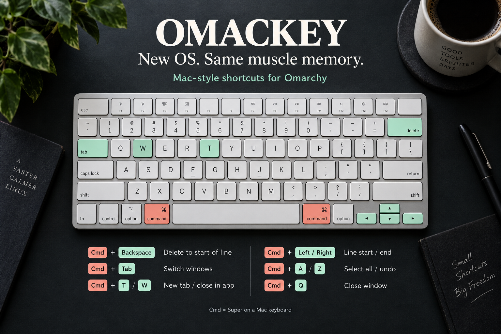
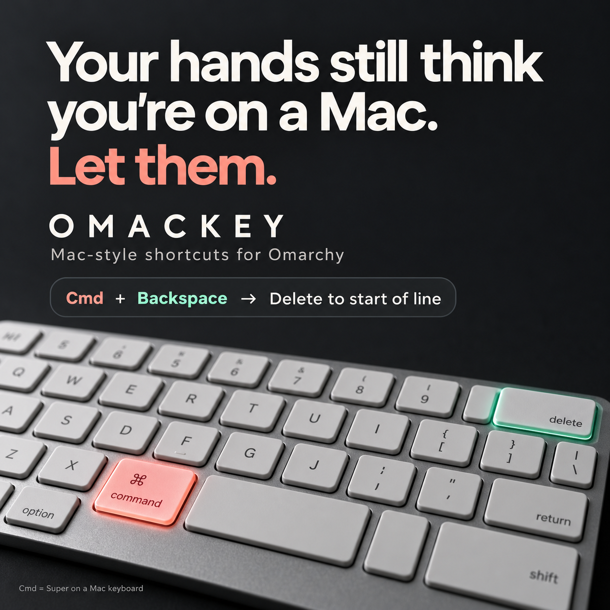

# Omackey

**New OS. Same muscle memory.**

Mac-style shortcuts for developers who move between macOS and Omarchy—or have just made the switch.



Your hands reach for `Cmd+Backspace` to delete to the start of a line. Then you remember which machine you're using. Omackey brings that habit, familiar application shortcuts, and a theme-aware window switcher to Omarchy.

On a Mac keyboard, **Cmd (⌘) is Super**. The shortcuts below use `Super`, the name used by Omarchy.

## Your everyday keys, back where you expect them

| Shortcut | With Omackey |
| --- | --- |
| `Super+Backspace` | Delete to the start of the line |
| `Super+Left` / `Super+Right` | Go to line start / end |
| `Alt+Left` / `Alt+Right` | Move by word |
| `Super+T` / `Super+W` | New tab / close in the focused app |
| `Super+Shift+T` | Reopen a closed tab |
| `Super+A` / `Super+Z` | Select all / undo |
| `Super+F` / `Super+S` | Find / save |
| `Super+L` | Focus the location bar |
| `Super+Tab` | Switch between windows with the overlay enabled |
| `Super+Q` | Close the focused window |

Application shortcuts send their corresponding Linux key sequences; the focused app determines their behavior. For delete-to-start, Omackey sends `Ctrl+U` to windows tagged `terminal`, and `Shift+Home` followed by `Backspace` elsewhere. For move-by-word, Omackey sends `Alt+B` / `Alt+F` to windows tagged `terminal`, and `Ctrl+Left` / `Ctrl+Right` elsewhere. `Super+Q` closes the focused window; it does not quit every window belonging to an application.

## Switcher

- Hold `Super` and press `Tab` or `Shift+Tab` to move through windows.
- Hold `Super` and press `` ` `` or `Shift+\`` to move through windows of the current application.
- Release `Super` to focus the highlighted window.
- Press `Super+Escape` to cancel. The Omarchy System menu moves to `Super+Ctrl+Escape`.
- Every window remains visible in a stable grid with its title and application icon.

## Window navigation

- Press `Ctrl+Left` or `Ctrl+Right` to focus the window in that direction. This
  also works across monitors and when full-width or fullscreen windows obscure
  other windows.
- Press `Super+Left` or `Super+Right` to move to the start or end of a line.
- Press `Alt+Left` or `Alt+Right` to move by word.
- Press `Super+Up` or `Super+Down` to focus the window in that direction.

## Application shortcuts

- Use `Super+T`, `W`, `A`, `Z`, `F`, `S`, `O`, `P`, `N`, `R`, and `L`
  for their familiar macOS-style application actions.
- Use `Super+Shift+T` to reopen a closed tab, `Super+Shift+Z` to redo, and
  `Super+Shift+N` to open a private window.
- Use `Super+[` and `Super+]` for back and forward, and `Super+G` or
  `Super+Shift+G` for the next or previous match.
- Use `Super+Backspace` to delete to the start of the line.

## Installation

```bash
git clone https://github.com/asaharan/omackey.git
cd omackey
./install.sh
```

The installer:

- Links this checkout into Omarchy
- Installs Mac key bindings (always active)
- Optionally installs the switcher UI overlay

After installation, Mac key bindings are immediately active. You can manage the switcher UI overlay:

```bash
./enable-switcher.sh   # Enable switcher UI overlay
./disable-switcher.sh  # Disable switcher UI overlay
./install.sh           # Re-run install to be prompted
```

Run `./uninstall.sh` to remove all Omackey integration.

## Native Omarchy plugin install

The overlay can also be installed through the plugin manager:

```bash
omarchy plugin add https://github.com/asaharan/omackey.git --enable
~/.config/omarchy/plugins/asaharan.omackey/install.sh
```

The second command installs the Hyprland bindings; Omarchy's plugin manager currently manages shell plugins but not compositor bindings.

## Updating

Omackey has no plugin registry — it's installed directly from this git repository, so
updates are pulled the same way.

If you installed via `omarchy plugin add` (or a manual `./install.sh` clone):

```bash
cd ~/.config/omarchy/plugins/asaharan.omackey
git pull
./install.sh
```

`install.sh` is safe to re-run: it refreshes the Hyprland bindings and re-prompts for
the switcher UI. Run `omarchy-shell shell rescanPlugins` afterward if the plugin doesn't
pick up the change.

See [CHANGELOG.md](CHANGELOG.md) for what changed in each release.

## Releasing

Releases are cut manually and tagged with [semantic versioning](https://semver.org/).

1. Bump `"version"` in `manifest.json`.
2. Add a new entry at the top of `CHANGELOG.md`.
3. Commit, tag, and push:

   ```bash
   git commit -am "release: vX.Y.Z"
   git tag -a vX.Y.Z -m "vX.Y.Z"
   git push origin main vX.Y.Z
   ```

4. Publish the GitHub release:

   ```bash
   gh release create vX.Y.Z --title vX.Y.Z --notes-from-tag
   ```

## Share Omackey

The landing page is in [`site/`](site/). Run `bun run preview` from the repository root and open `http://localhost:8000`. See the [website guide](docs/website.md) to preview it locally and publish it to `omackey.saharan.dev` with GitHub Pages.

Know someone whose hands still reach for Cmd? Send them this repo.



## License

MIT
